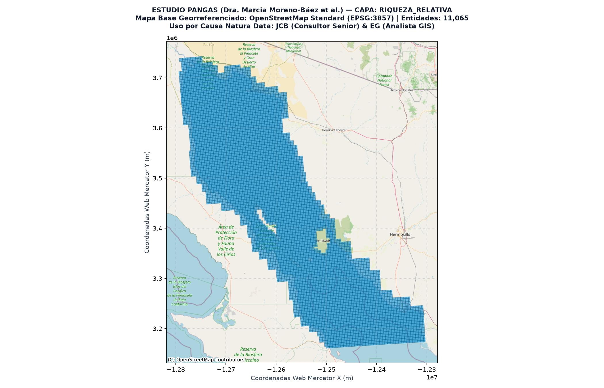
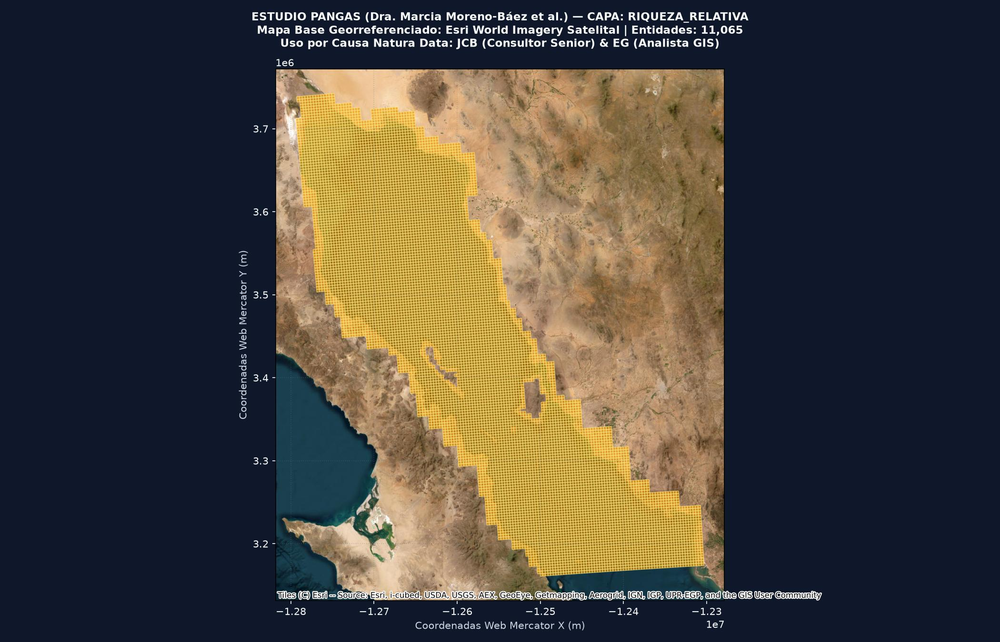

# Paquete Geográfico y Metadatos: Capa `Riqueza_Relativa`

**Título de la Capa:** Malla de Riqueza Biológica Pesquera Relativa  
**Base de Datos de Origen:** `Fish_Zones_PANGAS.gdb` (Estudio PANGAS)  

---

## 1. Atribución Académica y Cita Oficial

**Autora Principal de la Base de Datos:** Dra. Marcia Moreno-Báez et al.  
**Cita Académica Completa:**  
> Moreno-Báez, M., Cudney-Bueno, R., Shaw, W. W., Cudney-Bueno, S., & Torre-Cosío, J. (2011, 2012). Integrating spatial and temporal dimensions of artisanal fishing for management in the Gulf of California, Mexico. Ocean & Coastal Management / Marine Policy. Base de Datos Geográfica PANGAS.

**Uso y Adaptación Metodológica:**  
Esta capa constituye la línea base histórica del estudio PANGAS utilizada por **Juan Carlos Barrera (JCB - Consultor Senior)** y **Enrique Gorosave (EG - Analista GIS)** para el proyecto **IERC-GNL** de **Causa Natura Data (POA 2026-2028)**. Se utiliza para calibrar la exposición y sensibilidad de las comunidades pesqueras ante la infraestructura de Gas Natural Licuado en el Golfo de California.

---

## 2. Ficha Técnica Espacial

- **Nombre de la Capa en GDB:** `Riqueza_Relativa`
- **Tipo de Geometría:** `MultiPolygon`
- **Número Total de Polígonos / Entidades:** `11,065`
- **Sistema de Coordenadas Original:** EPSG:4326 (WGS 84 - Grados Decimales)
- **Proyección de Visualización:** EPSG:3857 (Web Mercator)
- **Extensión Geográfica (Bounding Box WGS84):** `MinLon: -114.9307, MinLat: 27.2977, MaxLon: -110.5188, MaxLat: 31.8423`
- **Artes de Pesca Relacionadas:** Todas las artes de pesca artesanal registradas en el Golfo de California

---

## 3. Descripción Metodológica

Polígonos de grilla espacial con acumulación de riqueza biológica pesquera derivada de las entrevistas del estudio PANGAS.

---

## 4. Visualización Cartográfica Georreferenciada

### Mapa Base: OpenStreetMap Estándar (Estilo QGIS)

### Mapa Base: Esri World Imagery (Satelital)

---

## 5. Tabla de Atributos Extraídos Estilo QGIS (52 Campos)

| Nombre del Campo | Tipo de Dato (QGIS/GDAL) | Valor de Ejemplo | Descripción y Rol Metodológico |
|---|---|---|---|
| `artnob` | `int16` | `0` | Especie pesquera: Balistes polylepis / Pez ballesta. |
| `atrtub` | `int16` | `0` | Especie pesquera: Atractoscion nobilis / Seabass. |
| `balpol` | `int16` | `0` | Especie pesquera: Balistes polylepis / Cochi. |
| `calbel` | `int16` | `0` | Atributo espacial registrado en la capa Riqueza_Relativa. |
| `carlim` | `int16` | `0` | Especie pesquera: Carcharias spp. / Tiburón. |
| `carspp` | `int16` | `0` | Especie pesquera: Caranx spp. / Jurel. |
| `cynoth` | `int16` | `0` | Atributo espacial registrado en la capa Riqueza_Relativa. |
| `cynpar` | `int16` | `0` | Atributo espacial registrado en la capa Riqueza_Relativa. |
| `cynspp` | `int16` | `0` | Atributo espacial registrado en la capa Riqueza_Relativa. |
| `dasdip` | `int16` | `0` | Atributo espacial registrado en la capa Riqueza_Relativa. |
| `dasspp` | `int16` | `0` | Atributo espacial registrado en la capa Riqueza_Relativa. |
| `dospon` | `int16` | `0` | Atributo espacial registrado en la capa Riqueza_Relativa. |
| `epiaca` | `int16` | `0` | Atributo espacial registrado en la capa Riqueza_Relativa. |
| `epiana` | `int16` | `0` | Atributo espacial registrado en la capa Riqueza_Relativa. |
| `epispp` | `int16` | `0` | Atributo espacial registrado en la capa Riqueza_Relativa. |
| `gymmar` | `int16` | `0` | Atributo espacial registrado en la capa Riqueza_Relativa. |
| `hexnig` | `int16` | `0` | Atributo espacial registrado en la capa Riqueza_Relativa. |
| `hopgue` | `int16` | `0` | Atributo espacial registrado en la capa Riqueza_Relativa. |
| `isofus` | `int16` | `0` | Especie pesquera: Isostichopus fuscus / Pepino de mar. |
| `litsty` | `int16` | `0` | Especie pesquera: Litopenaeus stylirostris / Camarón azul. |
| `lutarg` | `int16` | `0` | Atributo espacial registrado en la capa Riqueza_Relativa. |
| `lutper` | `int16` | `0` | Atributo espacial registrado en la capa Riqueza_Relativa. |
| `micmeg` | `int16` | `0` | Atributo espacial registrado en la capa Riqueza_Relativa. |
| `mugspp` | `int16` | `0` | Atributo espacial registrado en la capa Riqueza_Relativa. |
| `muscal` | `int16` | `0` | Atributo espacial registrado en la capa Riqueza_Relativa. |
| `muslun` | `int16` | `0` | Atributo espacial registrado en la capa Riqueza_Relativa. |
| `musspp` | `int16` | `0` | Atributo espacial registrado en la capa Riqueza_Relativa. |
| `mycjor` | `int16` | `0` | Atributo espacial registrado en la capa Riqueza_Relativa. |
| `mycpri` | `int16` | `0` | Atributo espacial registrado en la capa Riqueza_Relativa. |
| `mycros` | `int16` | `0` | Atributo espacial registrado en la capa Riqueza_Relativa. |
| `mylcal` | `int16` | `0` | Atributo espacial registrado en la capa Riqueza_Relativa. |
| `myllon` | `int16` | `0` | Atributo espacial registrado en la capa Riqueza_Relativa. |
| `octspp` | `int16` | `0` | Atributo espacial registrado en la capa Riqueza_Relativa. |
| `pangen` | `int16` | `0` | Atributo espacial registrado en la capa Riqueza_Relativa. |
| `paninf` | `int16` | `0` | Atributo espacial registrado en la capa Riqueza_Relativa. |
| `paraur` | `int16` | `0` | Atributo espacial registrado en la capa Riqueza_Relativa. |
| `parmac` | `int16` | `0` | Atributo espacial registrado en la capa Riqueza_Relativa. |
| `parple` | `int16` | `0` | Atributo espacial registrado en la capa Riqueza_Relativa. |
| `parspp` | `int16` | `0` | Atributo espacial registrado en la capa Riqueza_Relativa. |
| `phyery` | `int16` | `0` | Atributo espacial registrado en la capa Riqueza_Relativa. |
| `pinrug` | `int16` | `0` | Especie pesquera: Pinna rugosa / Hacha de labio. |
| `rhilon` | `int16` | `0` | Atributo espacial registrado en la capa Riqueza_Relativa. |
| `rhipro` | `int16` | `0` | Atributo espacial registrado en la capa Riqueza_Relativa. |
| `rhispp` | `int16` | `0` | Atributo espacial registrado en la capa Riqueza_Relativa. |
| `scospp` | `int16` | `0` | Atributo espacial registrado en la capa Riqueza_Relativa. |
| `sphspp` | `int16` | `0` | Atributo espacial registrado en la capa Riqueza_Relativa. |
| `spocal` | `int16` | `0` | Atributo espacial registrado en la capa Riqueza_Relativa. |
| `squcal` | `int16` | `0` | Atributo espacial registrado en la capa Riqueza_Relativa. |
| `stegig` | `int16` | `0` | Especie pesquera: Strombus gigas / Caracol. |
| `all` | `float64` | `0.0` | Acumulado de riqueza biológica total. |
| `Shape_Length` | `float64` | `11112.0` | Perímetro total del polígono expresado en metros. |
| `Shape_Area` | `float64` | `7717284.0` | Superficie o área total del polígono expresada en metros cuadrados. |
