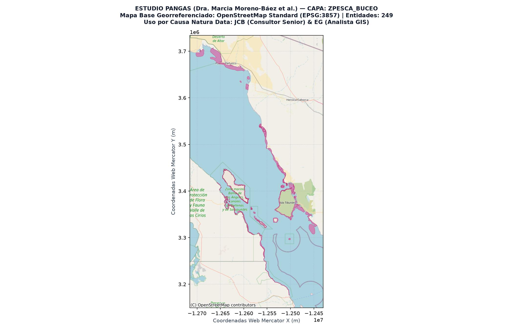
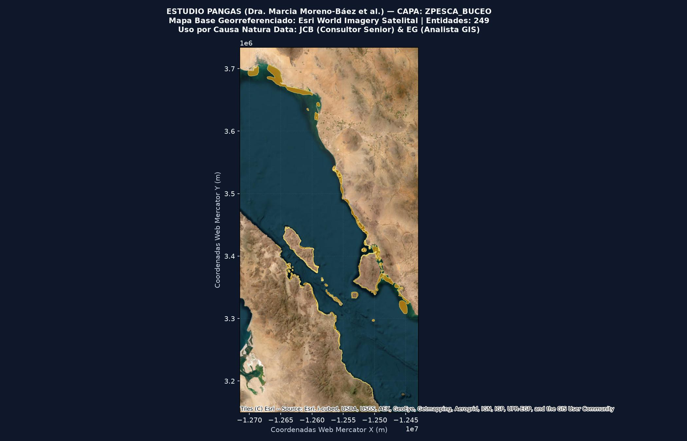

# Paquete Geográfico y Metadatos: Capa `ZPesca_Buceo`

**Título de la Capa:** Polígonos de Pesca Comercial por Buceo  
**Base de Datos de Origen:** `Fish_Zones_PANGAS.gdb` (Estudio PANGAS)  

---

## 1. Atribución Académica y Cita Oficial

**Autora Principal de la Base de Datos:** Dra. Marcia Moreno-Báez et al.  
**Cita Académica Completa:**  
> Moreno-Báez, M., Cudney-Bueno, R., Shaw, W. W., Cudney-Bueno, S., & Torre-Cosío, J. (2011, 2012). Integrating spatial and temporal dimensions of artisanal fishing for management in the Gulf of California, Mexico. Ocean & Coastal Management / Marine Policy. Base de Datos Geográfica PANGAS.

**Uso y Adaptación Metodológica:**  
Esta capa constituye la línea base histórica del estudio PANGAS utilizada por **Juan Carlos Barrera (JCB - Consultor Senior)** y **Enrique Gorosave (EG - Analista GIS)** para el proyecto **IERC-GNL** de **Causa Natura Data (POA 2026-2028)**. Se utiliza para calibrar la exposición y sensibilidad de las comunidades pesqueras ante la infraestructura de Gas Natural Licuado en el Golfo de California.

---

## 2. Ficha Técnica Espacial

- **Nombre de la Capa en GDB:** `ZPesca_Buceo`
- **Tipo de Geometría:** `MultiPolygon`
- **Número Total de Polígonos / Entidades:** `249`
- **Sistema de Coordenadas Original:** EPSG:4326 (WGS 84 - Grados Decimales)
- **Proyección de Visualización:** EPSG:3857 (Web Mercator)
- **Extensión Geográfica (Bounding Box WGS84):** `MinLon: -114.1083, MinLat: 27.4209, MaxLon: -111.7763, MaxLat: 31.5724`
- **Artes de Pesca Relacionadas:** Buceo autónomo y semiautónomo (Hookah)

---

## 3. Descripción Metodológica

Campos y caladeros de pesca artesanal por buceo autónomo y hookah (moluscos, bentónicos, almeja, callo de hacha, erizo, pepino de mar).

---

## 4. Visualización Cartográfica Georreferenciada

### Mapa Base: OpenStreetMap Estándar (Estilo QGIS)

### Mapa Base: Esri World Imagery (Satelital)

---

## 5. Tabla de Atributos Extraídos Estilo QGIS (5 Campos)

| Nombre del Campo | Tipo de Dato (QGIS/GDAL) | Valor de Ejemplo | Descripción y Rol Metodológico |
|---|---|---|---|
| `no_comunid` | `int16` | `1` | Número correlativo de comunidad pesquera. |
| `comunidad` | `str` | `PPE, , , , , , , ,` | Nombre o código corto de la comunidad costera. |
| `ORIG_FID` | `int32` | `0` | Identificador de registro original en el dataset de origen. |
| `Shape_Length` | `float64` | `240636.40965902145` | Perímetro total del polígono expresado en metros. |
| `Shape_Area` | `float64` | `557068833.8007089` | Superficie o área total del polígono expresada en metros cuadrados. |
