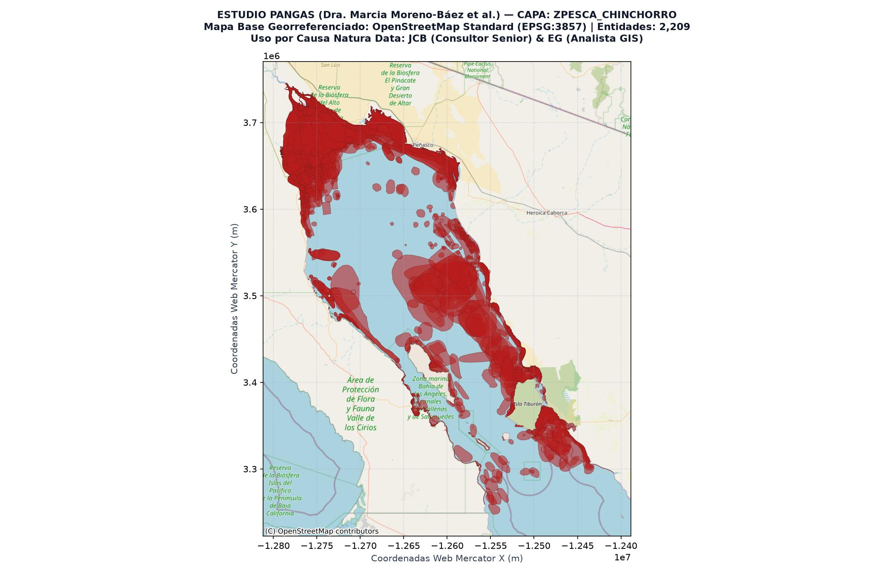
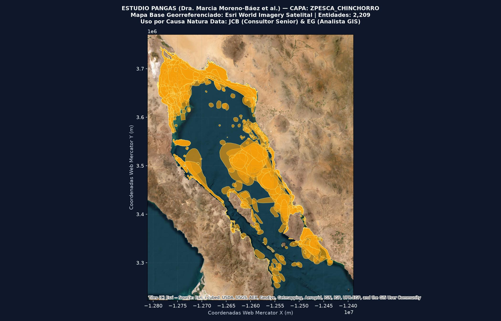

# Paquete Geográfico y Metadatos: Capa `ZPesca_Chinchorro`

**Título de la Capa:** Polígonos de Pesca con Chinchorro de Línea  
**Base de Datos de Origen:** `Fish_Zones_PANGAS.gdb` (Estudio PANGAS)  

---

## 1. Atribución Académica y Cita Oficial

**Autora Principal de la Base de Datos:** Dra. Marcia Moreno-Báez et al.  
**Cita Académica Completa:**  
> Moreno-Báez, M., Cudney-Bueno, R., Shaw, W. W., Cudney-Bueno, S., & Torre-Cosío, J. (2011, 2012). Integrating spatial and temporal dimensions of artisanal fishing for management in the Gulf of California, Mexico. Ocean & Coastal Management / Marine Policy. Base de Datos Geográfica PANGAS.

**Uso y Adaptación Metodológica:**  
Esta capa constituye la línea base histórica del estudio PANGAS utilizada por **Juan Carlos Barrera (JCB - Consultor Senior)** y **Enrique Gorosave (EG - Analista GIS)** para el proyecto **IERC-GNL** de **Causa Natura Data (POA 2026-2028)**. Se utiliza para calibrar la exposición y sensibilidad de las comunidades pesqueras ante la infraestructura de Gas Natural Licuado en el Golfo de California.

---

## 2. Ficha Técnica Espacial

- **Nombre de la Capa en GDB:** `ZPesca_Chinchorro`
- **Tipo de Geometría:** `MultiPolygon`
- **Número Total de Polígonos / Entidades:** `2,209`
- **Sistema de Coordenadas Original:** EPSG:4326 (WGS 84 - Grados Decimales)
- **Proyección de Visualización:** EPSG:3857 (Web Mercator)
- **Extensión Geográfica (Bounding Box WGS84):** `MinLon: -114.9171, MinLat: 27.9883, MaxLon: -111.4621, MaxLat: 31.8624`
- **Artes de Pesca Relacionadas:** Chinchorro de línea / Redes agalleras de playa

---

## 3. Descripción Metodológica

Zonas de operación pesquera artesanal mediante chinchorros de línea de playa y deriva para capturas de peces de escama.

---

## 4. Visualización Cartográfica Georreferenciada

### Mapa Base: OpenStreetMap Estándar (Estilo QGIS)

### Mapa Base: Esri World Imagery (Satelital)

---

## 5. Tabla de Atributos Extraídos Estilo QGIS (22 Campos)

| Nombre del Campo | Tipo de Dato (QGIS/GDAL) | Valor de Ejemplo | Descripción y Rol Metodológico |
|---|---|---|---|
| `Id` | `int32` | `2` | Identificador único numérico del registro de zona pesquera. |
| `CODE` | `str` | `B` | Código alfanumérico asignado al polígono de pesca. |
| `M` | `str` | `0` | Indicador del mes o temporada (1 = activo, 0 = inactivo). |
| `J` | `str` | `0` | Indicador estacional o de pesquería. |
| `R` | `str` | `0` | Indicador de región o zona pesquera. |
| `G` | `str` | `0` | Indicador de grupo pesquero o gremio. |
| `NAME` | `str` | `El Bajo Macho` | Nombre geográfico o toponímico del sitio de pesca. |
| `ENTREVIS` | `str` | `SLG04SP030506` | Código único de la encuesta o entrevista participativa PANGAS. |
| `Int_id` | `int32` | `0` | Identificador numérico del pescador o informante clave. |
| `Ent_num` | `int16` | `4` | Número secuencial de la entrevista efectuada. |
| `Entvsdr` | `str` | `SP` | Iniciales o código del entrevistador de campo. |
| `mes` | `int16` | `0` | Mes del levantamiento o temporada de pesca (1-12). |
| `dia` | `int16` | `0` | Día del levantamiento en campo. |
| `ano` | `int16` | `0` | Año del registro de la información (ej. 2005, 2006). |
| `spp_code` | `str` | `LITSTY` | Código taxonómico estándar de la especie (ej. LITSTY = Litopenaeus stylirostris). |
| `sitio_code` | `str` | `SLG` | Código corto del campo o comunidad pesquera (ej. SLG, PLO). |
| `Met_Pesca` | `str` | `Chinchorro` | Método o arte de pesca registrado (ej. Chinchorro, Trampa, Buceo). |
| `HABITAT` | `str` | `arena` | Tipo de sustrato o hábitat bentónico (ej. arena, arrecife, fango). |
| `CODE_COMP` | `str` | `SLG04SP030506_B` | Código compuesto de identificación espacial. |
| `CODE_FIN` | `str` | `SLG04SP030506_B_LITSTY` | Código final concatenado de sitio, entrevista y especie. |
| `Shape_Length` | `float64` | `52970.66149454901` | Perímetro total del polígono expresado en metros. |
| `Shape_Area` | `float64` | `199078841.69311696` | Superficie o área total del polígono expresada en metros cuadrados. |

### Muestra de Especies Registradas (Códigos SPP):
`ATRNOB, CARANX, CARLIM, CARSPP, CYNOTH, CYNPAR, CYNSPP, DASDIP, DASSPP, GYMMAR, HOPGUE, LITSTY, LUTARG, MICMEG, MUGSPP, MUSCAL, MUSLUN, MUSSPP, MYCJOR, MYLCAL, MYLLON, PARPLE, RHILON, RHIPRO, RHISPP`
