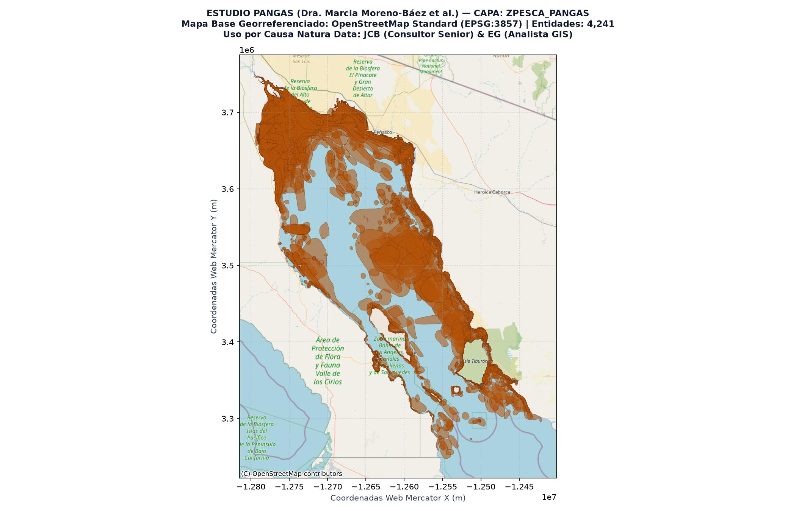
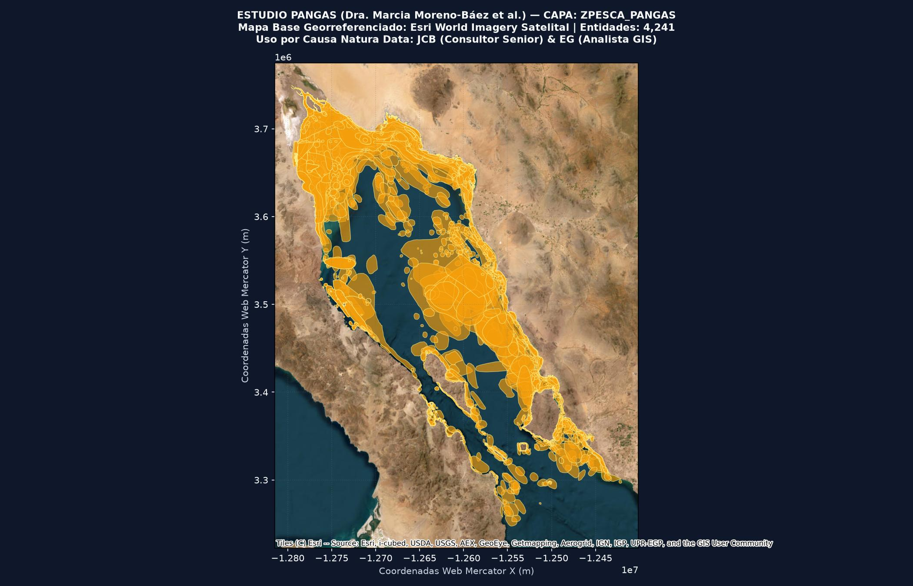

# Paquete Geográfico y Metadatos: Capa `ZPesca_PANGAS`

**Título de la Capa:** Base Unificada de Zonas Pesqueras PANGAS  
**Base de Datos de Origen:** `Fish_Zones_PANGAS.gdb` (Estudio PANGAS)  

---

## 1. Atribución Académica y Cita Oficial

**Autora Principal de la Base de Datos:** Dra. Marcia Moreno-Báez et al.  
**Cita Académica Completa:**  
> Moreno-Báez, M., Cudney-Bueno, R., Shaw, W. W., Cudney-Bueno, S., & Torre-Cosío, J. (2011, 2012). Integrating spatial and temporal dimensions of artisanal fishing for management in the Gulf of California, Mexico. Ocean & Coastal Management / Marine Policy. Base de Datos Geográfica PANGAS.

**Uso y Adaptación Metodológica:**  
Esta capa constituye la línea base histórica del estudio PANGAS utilizada por **Juan Carlos Barrera (JCB - Consultor Senior)** y **Enrique Gorosave (EG - Analista GIS)** para el proyecto **IERC-GNL** de **Causa Natura Data (POA 2026-2028)**. Se utiliza para calibrar la exposición y sensibilidad de las comunidades pesqueras ante la infraestructura de Gas Natural Licuado en el Golfo de California.

---

## 2. Ficha Técnica Espacial

- **Nombre de la Capa en GDB:** `ZPesca_PANGAS`
- **Tipo de Geometría:** `MultiPolygon`
- **Número Total de Polígonos / Entidades:** `4,241`
- **Sistema de Coordenadas Original:** EPSG:4326 (WGS 84 - Grados Decimales)
- **Proyección de Visualización:** EPSG:3857 (Web Mercator)
- **Extensión Geográfica (Bounding Box WGS84):** `MinLon: -114.9492, MinLat: 27.9883, MaxLon: -111.5713, MaxLat: 31.8958`
- **Artes de Pesca Relacionadas:** Multiespecie / PANGAS

---

## 3. Descripción Metodológica

Capa geográfica consolidada de campos pesqueros artesanales del Golfo de California basada en el mapeo participativo original de la Dra. Marcia Moreno-Báez.

---

## 4. Visualización Cartográfica Georreferenciada

### Mapa Base: OpenStreetMap Estándar (Estilo QGIS)

### Mapa Base: Esri World Imagery (Satelital)

---

## 5. Diccionario de Atributos (19 Campos)

| Nombre de Campo | Tipo de Dato | Rol / Descripción Metodológica |
|---|---|---|
| `Id` | `int32` | Atributo espacial/pesquero registrado en PANGAS |
| `CODE` | `str` | Atributo espacial/pesquero registrado en PANGAS |
| `M` | `str` | Atributo espacial/pesquero registrado en PANGAS |
| `J` | `str` | Atributo espacial/pesquero registrado en PANGAS |
| `R` | `str` | Atributo espacial/pesquero registrado en PANGAS |
| `G` | `str` | Atributo espacial/pesquero registrado en PANGAS |
| `ENTREVIS` | `str` | Atributo espacial/pesquero registrado en PANGAS |
| `Ent_num` | `int16` | Atributo espacial/pesquero registrado en PANGAS |
| `Entvsdr` | `str` | Atributo espacial/pesquero registrado en PANGAS |
| `spp_code` | `str` | Atributo espacial/pesquero registrado en PANGAS |
| `sitio_code` | `str` | Atributo espacial/pesquero registrado en PANGAS |
| `HABITAT` | `str` | Atributo espacial/pesquero registrado en PANGAS |
| `day` | `int16` | Atributo espacial/pesquero registrado en PANGAS |
| `month` | `int16` | Atributo espacial/pesquero registrado en PANGAS |
| `year` | `int16` | Atributo espacial/pesquero registrado en PANGAS |
| `sitio_nomb` | `str` | Atributo espacial/pesquero registrado en PANGAS |
| `CODE_COMP` | `str` | Atributo espacial/pesquero registrado en PANGAS |
| `Shape_Length` | `float64` | Atributo espacial/pesquero registrado en PANGAS |
| `Shape_Area` | `float64` | Atributo espacial/pesquero registrado en PANGAS |

### Muestra de Especies Registradas (Códigos SPP):
`ATRNOB, ATRTUB, BALPOL, CALBEL, CARANX, CARLIM, CARSPP, CYNOTH, CYNPAR, CYNSPP, DASSPP, DOSPON, EPIACA, EPIANA, EPISPP, GYMMAR, HEXNIG, HOPGUE, ISOFUS, LITSTY, LUTARG, LUTPER, MICMEG, MUGSPP, MUSCAL`
