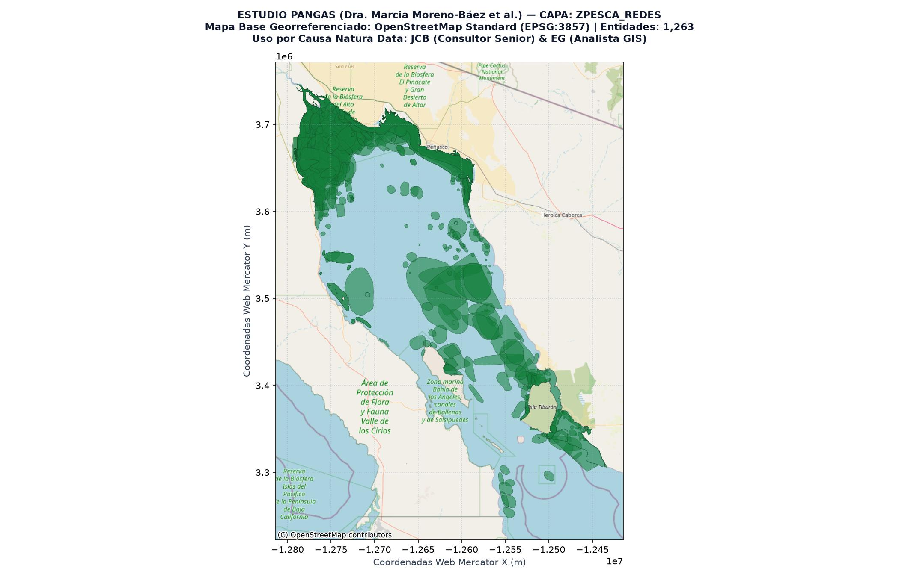

# Paquete Geográfico y Metadatos: Capa `ZPesca_Redes`

**Título de la Capa:** Polígonos de Pesca con Redes de Enmalle  
**Base de Datos de Origen:** `Fish_Zones_PANGAS.gdb` (Estudio PANGAS)  

---

## 1. Atribución Académica y Cita Oficial

**Autora Principal de la Base de Datos:** Dra. Marcia Moreno-Báez et al.  
**Cita Académica Completa:**  
> Moreno-Báez, M., Cudney-Bueno, R., Shaw, W. W., Cudney-Bueno, S., & Torre-Cosío, J. (2011, 2012). Integrating spatial and temporal dimensions of artisanal fishing for management in the Gulf of California, Mexico. Ocean & Coastal Management / Marine Policy. Base de Datos Geográfica PANGAS.

**Uso y Adaptación Metodológica:**  
Esta capa constituye la línea base histórica del estudio PANGAS utilizada por **Juan Carlos Barrera (JCB - Consultor Senior)** y **Enrique Gorosave (EG - Analista GIS)** para el proyecto **IERC-GNL** de **Causa Natura Data (POA 2026-2028)**. Se utiliza para calibrar la exposición y sensibilidad de las comunidades pesqueras ante la infraestructura de Gas Natural Licuado en el Golfo de California.

---

## 2. Ficha Técnica Espacial

- **Nombre de la Capa en GDB:** `ZPesca_Redes`
- **Tipo de Geometría:** `MultiPolygon`
- **Número Total de Polígonos / Entidades:** `1,263`
- **Sistema de Coordenadas Original:** EPSG:4326 (WGS 84 - Grados Decimales)
- **Proyección de Visualización:** EPSG:3857 (Web Mercator)
- **Extensión Geográfica (Bounding Box WGS84):** `MinLon: -114.9402, MinLat: 27.9883, MaxLon: -111.6857, MaxLat: 31.8724`
- **Artes de Pesca Relacionadas:** Redes de enmalle / Agalleras de fondo y deriva

---

## 3. Descripción Metodológica

Zonas de esfuerzo pesquero artesanal con redes agalleras de fondo y deriva para especies demersales y pelágicas.

---

## 4. Visualización Cartográfica Georreferenciada

### Mapa Base: OpenStreetMap Estándar (Estilo QGIS)

### Mapa Base: Esri World Imagery (Satelital)

---

## 5. Diccionario de Atributos (24 Campos)

| Nombre de Campo | Tipo de Dato | Rol / Descripción Metodológica |
|---|---|---|
| `Id` | `int32` | Atributo espacial/pesquero registrado en PANGAS |
| `CODE` | `str` | Atributo espacial/pesquero registrado en PANGAS |
| `M` | `str` | Atributo espacial/pesquero registrado en PANGAS |
| `J` | `str` | Atributo espacial/pesquero registrado en PANGAS |
| `R` | `str` | Atributo espacial/pesquero registrado en PANGAS |
| `G` | `str` | Atributo espacial/pesquero registrado en PANGAS |
| `NAME` | `str` | Atributo espacial/pesquero registrado en PANGAS |
| `ENTREVIS` | `str` | Atributo espacial/pesquero registrado en PANGAS |
| `Int_id` | `int32` | Atributo espacial/pesquero registrado en PANGAS |
| `Ent_num` | `int16` | Atributo espacial/pesquero registrado en PANGAS |
| `Entvsdr` | `str` | Atributo espacial/pesquero registrado en PANGAS |
| `mes` | `int16` | Atributo espacial/pesquero registrado en PANGAS |
| `dia` | `int16` | Atributo espacial/pesquero registrado en PANGAS |
| `ano` | `int16` | Atributo espacial/pesquero registrado en PANGAS |
| `spp_code` | `str` | Atributo espacial/pesquero registrado en PANGAS |
| `sitio_code` | `str` | Atributo espacial/pesquero registrado en PANGAS |
| `Met_Pesca` | `str` | Atributo espacial/pesquero registrado en PANGAS |
| `HABITAT` | `str` | Atributo espacial/pesquero registrado en PANGAS |
| `weight_pc` | `float64` | Atributo espacial/pesquero registrado en PANGAS |
| `NorSur` | `int16` | Atributo espacial/pesquero registrado en PANGAS |
| `TEMP` | `str` | Atributo espacial/pesquero registrado en PANGAS |
| `NAME_ORG` | `str` | Atributo espacial/pesquero registrado en PANGAS |
| `Shape_Length` | `float64` | Atributo espacial/pesquero registrado en PANGAS |
| `Shape_Area` | `float64` | Atributo espacial/pesquero registrado en PANGAS |

### Muestra de Especies Registradas (Códigos SPP):
`GYMMAR, LITSTY, MUSCAL, MUSLUN, MUSSPP, MYLCAL, MYLLON, RHILON, RHIPRO, RHISPP`
